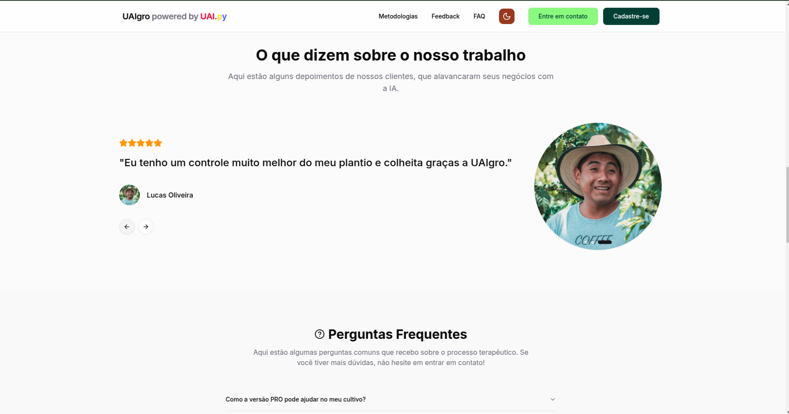

# Landing Page UAIgro

# Sobre o projeto

Landing Page para a UAIgro, uma empresa de [UAI.py](https://github.com/uaipy)

# Tecnologias

- ReactJs
- Tailwind CSS
- TypeScript
- Shadcn UI
- Vite
- React Hook Form

# Como executar o projeto

1. Clone o repositório

2. Instale as dependências

```bash
npm install
```

3. Execute o projeto

```bash
npm run dev
```

# Como contribuir

1. Fork o repositório
2. Crie uma branch
3. Faça o commit das suas alterações
4. Push a sua branch
5. Crie um Pull Request

# Nosso time

- [@ruann3res](https://github.com/ruann3res)
- [@laSant0s](https://github.com/laSant0s)
- [@stclaire1](https://github.com/stclaire1)
- [@andrelvicente](https://github.com/andrelvicente)
- [@Viniciusom13](https://github.com/Viniciusom13)
- [@Matheus21sousa](https://github.com/Matheus21sousa)

# Nosso site rodando

[https://uaigro.vercel.app/](https://uaigro.vercel.app/)

# Algumas Fotos e Gif do projeto





